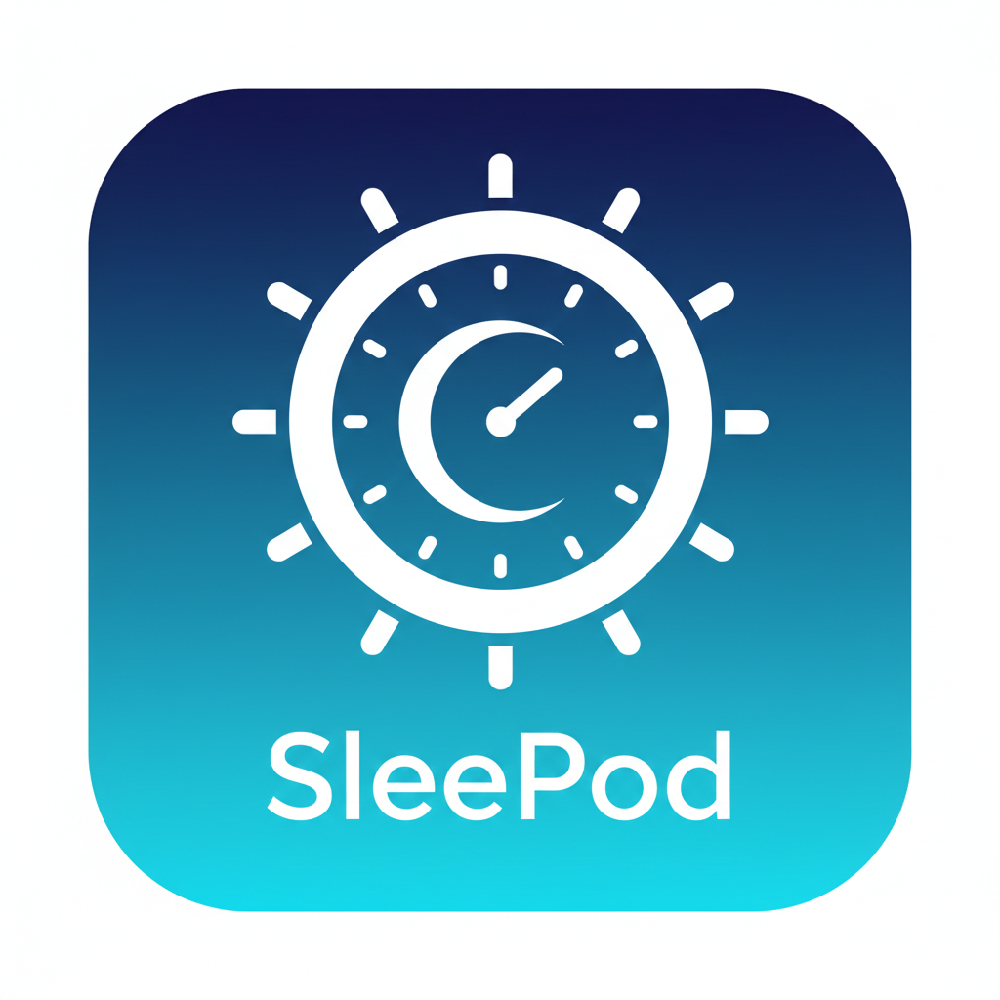
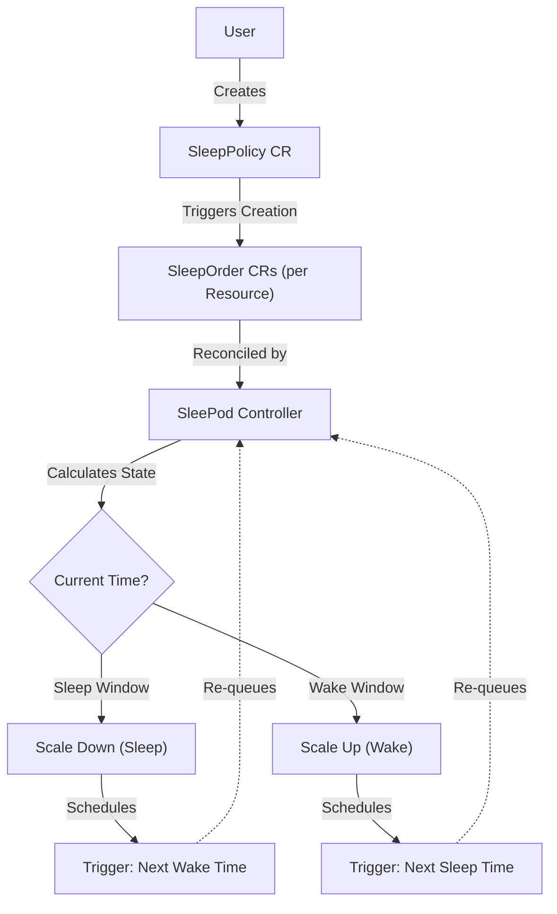

# SleePod-controller 

SleePod-controller is a Kubernetes controller designed to manage the sleep and wake cycles of your Kubernetes workloads. It allows you to define policies for when your deployments and statefulsets should be scaled down (sleep) and scaled up (wake), helping you save resources and costs in non-production environments.

## How it Works

SleePod-controller operates by managing `SleepPolicy` resources. Each policy defines a schedule for scaling deployments and statefulsets. The controller calculates the next sleep or wake time based on your configuration and the specified timezone.

When a scheduled time is reached, the controller creates internal `SleepOrder` resources to execute the scaling operations (Sleep: scale to 0, Wake: scale to original replicas).



> **Note**: Users only need to define `SleepPolicy`. The `SleepOrder` resources are created and managed automatically by the controller. You do not need to create them manually. Both `SleepPolicy` and `SleepOrder` are **namespace-scoped**, meaning a policy only affects resources within the same namespace.

## Features

- **Automated Sleep/Wake Schedules**: Define precise schedules for sleeping and waking workloads.
- **Policy-Based Management**: Create `SleepPolicy` resources to group and manage workloads.
- **Resource Support**: Supports Deployments and StatefulSets.
- **Configurable Timezones**: Schedule sleep/wake times in your local timezone.
- **Namespace TTL**: Automatically delete namespaces after a configurable number of days.

## Namespace TTL

You can enable the Namespace TTL feature to automatically delete namespaces that are older than a configured expiration time. This is useful for cleaning up ephemeral testing environments.

To enable this globally, set `config.namespaceTTLEnabled` to `true` in your Helm values or set the `SLEEPOD_NAMESPACE_TTL_ENABLED` environment variable. (the default is false)

After enabling the TTL, you can define the expiration time in days using `config.namespaceExpirationTTLInDays` in your Helm values or set the `SLEEPOD_NAMESPACE_TTL_DAYS` environment variable. (the default is 30 days)

The expiration date is calculated based on the creation time of the namespace or when the controller first processes it, plus the configured TTL days. You can also manually set or override the expiration date using the annotation:

```yaml
metadata:
  annotations:
    sleepod.io/expirationDate: "01/01/2027" # DD/MM/YYYY
```

## Installation

### Prerequisites

- Kubernetes cluster (v1.24+)
- Helm (3.0+)

### Install using Helm

1. Add the Helm repository:
   ```bash
   helm repo add sleepod https://sleepod-io.github.io/Sleepod-controller
   helm repo update
   ```

2. Install the Helm chart:
   ```bash
   helm install sleepod-controller sleepod/sleepod-controller -n sleepod-controller-system --create-namespace
   ```

3. Verify the installation:
   ```bash
   kubectl get pods -n sleepod-controller-system
   ```

## Usage

### 1. Create a SleepPolicy

Create a `SleepPolicy` manifest to define your sleep schedule. You can define default settings for all deployments/statefulsets in a namespace, or target specific ones by name.

```yaml
apiVersion: sleepod.sleepod.io/v1alpha1
kind: SleepPolicy
metadata:
  name: dev-team-policy
  namespace: default
spec:
  timezone: "UTC"
  deployments:
    # "default" applies to all deployments in the namespace unless overridden
    default:
      enable: true
      sleepAt: "20:00" # 8:00 PM
      wakeAt: "08:00"  # 8:00 AM
      workingDays: "Monday-Friday" # Optional: Restrict to working days only
    # specific deployment override
    backend-service:
      enable: false # Do not sleep this service
  statefulSets:
    db-primary:
      enable: true
      sleepAt: "22:00"
      wakeAt: "06:00"
      workingDays: "Monday-Friday"
    # Example: Disable default for statefulsets (only db-primary will be managed)
    default:
      enable: false
```

### 2. Apply the Policy

```bash
kubectl apply -f my-policy.yaml
```

The controller will now monitor the resources in the `default` namespace. It will automatically create `SleepOrder` resources to scale the workloads down and up at the specified times.

## Configuration

The Helm chart can be customized using `values.yaml`. Here are the most common configurations:

| Parameter | Description | Default |
|-----------|-------------|---------|
| `config.defaultTimezone` | Default timezone for policies if not specified | `"UTC"` |
| `config.defaultSleepAt` | Default sleep time | `"20:00"` |
| `config.defaultWakeAt` | Default wake time | `"08:00"` |
| `config.excludedNamespaces` | List of namespaces the controller should ignore | `kube-system`, etc. |
| `config.namespaceTTLEnabled` | Enable Namespace TTL feature | `false` |
| `config.namespaceExpirationTTLInDays` | Default TTL in days for namespaces | `30` |
| `sleepod.io/exclude` | Annotation to exclude a namespace from being managed | `"true"` (on Namespace) |
| `config.namespaceDelaySeconds`| Delay before processing changes | `20` |
| `config.weekend` | Comma-separated list of weekend days (e.g., "Saturday,Sunday") | `""` |
| `config.excludeWeekend` | Whether to automatically exclude weekend days from default working days | `false` |
| `config.defaultPolicyEnabled` | Whether default policies are enabled | `false` |
| `controllerManager.replicas` | Number of controller replicas | `1` |
| `controllerManager.nodeSelector` | Node labels for pod assignment | `{}` |
| `controllerManager.tolerations` | Tolerations for pod assignment | `[]` |
| `controllerManager.affinity` | Affinity rules for pod assignment | `{}` |
| `resources.requests/limits` | CPU/Memory requests and limits | (See values.yaml) |


## ArgoCD Compatibility

If you are using ArgoCD to manage your deployments, and you are using auto-sync configuration, you should update your applications to ignoreDifferences or globaly ignore the `spec.replicas` field on argocd-cm to prevent ArgoCD from fighting with the controller when it scales down resources.

## Contributing

We welcome contributions! Please see [CONTRIBUTING.md](CONTRIBUTING.md) for details on how to get started.

## License

This project is licensed under the Apache License 2.0 - see the [LICENSE](LICENSE) file for details.

## Contact

**Shay Geffen**

- Email: shaygef123@gmail.com
- LinkedIn: [Shay Geffen](https://www.linkedin.com/in/shay-geffen-051357217/)
- Github [shaygef123](https://github.com/shaygef123)
